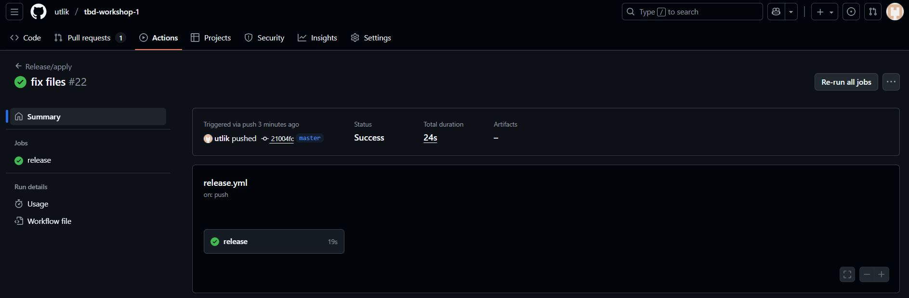
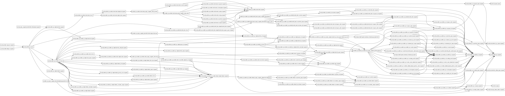
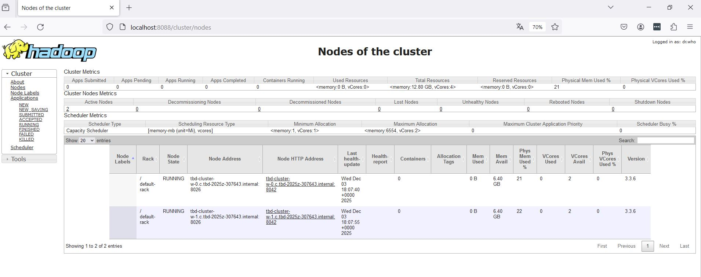
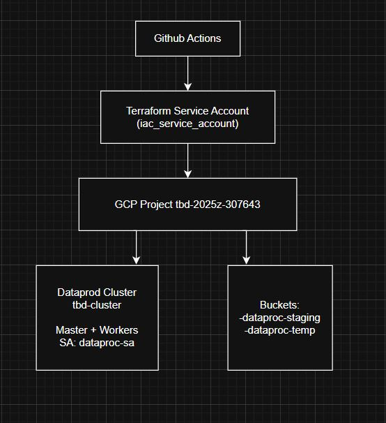
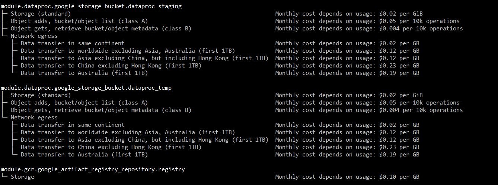
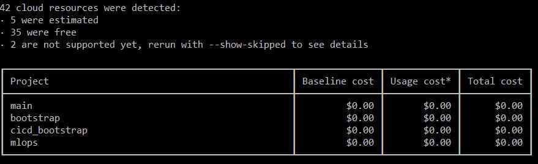
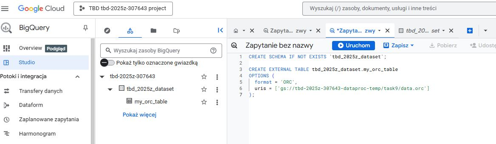
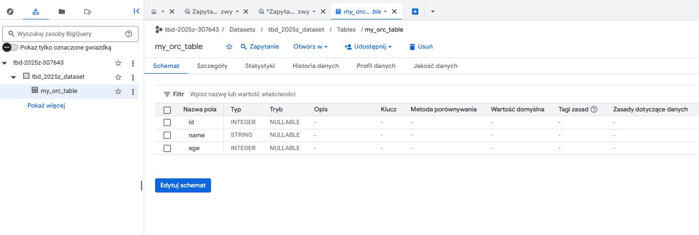
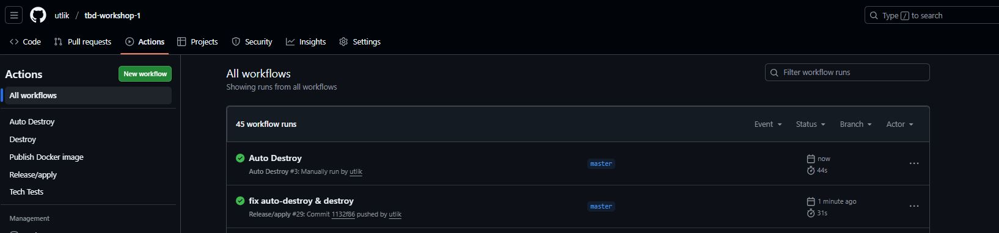

IMPORTANT ❗ ❗ ❗ Please remember to destroy all the resources after each work session. You can recreate infrastructure by creating new PR and merging it to master.


1. Authors: 

17, 
https://github.com/utlik/tbd-workshop-1

2. Follow all steps in README.md.
3. From avaialble Github Actions select and run destroy on main branch.
4. Create new git branch and:
    1. Modify tasks-phase1.md file.
    2. Create PR from this branch to **YOUR** master and merge it to make new release. 
	

5. Analyze terraform code. Play with terraform plan, terraform graph to investigate different modules.

Moduł VPC to gotowy do użycia blok kodu Terraform, który automatyzuje tworzenie i zarządzanie wirtualnymi chmurami prywatnymi (VPC). 
Moduł upraszcza proces tworzenia infrastruktury sieciowej, w tym podsieci, reguły firewalla, routing i td. 
Umożliwia ponowne wykorzystanie konfiguracji i zarządzanie całą siecią jako pojedynczym komponentem.

Moduł VPC w naszym projekcie to moduł lokalny ./modules/vpc. Odpowiada za tworzenie i konfigurowanie prywatnej sieci chmurowej (VPC) w Google Cloud Platform (GCP).

$ terraform graph | grep ">" | grep "vpc"
  "google_compute_firewall.allow-all-internal" -> "module.vpc.module.vpc.module.vpc.google_compute_shared_vpc_host_project.shared_vpc_host";
  "module.composer.google_compute_subnetwork.composer-subnet" -> "module.vpc.google_compute_firewall.default-internal-allow-all";
  "module.composer.google_compute_subnetwork.composer-subnet" -> "module.vpc.google_compute_firewall.fw-allow-ingress-from-iap";
  "module.composer.google_compute_subnetwork.composer-subnet" -> "module.vpc.module.cloud-router.google_compute_router_nat.nats";
  "module.composer.google_compute_subnetwork.composer-subnet" -> "module.vpc.module.vpc.module.firewall_rules.google_compute_firewall.rules";
  "module.composer.google_compute_subnetwork.composer-subnet" -> "module.vpc.module.vpc.module.firewall_rules.google_compute_firewall.rules_ingress_egress";
  "module.composer.google_compute_subnetwork.composer-subnet" -> "module.vpc.module.vpc.module.routes.google_compute_route.route";
  "module.composer.google_compute_subnetwork.composer-subnet" -> "module.vpc.module.vpc.module.vpc.google_compute_shared_vpc_host_project.shared_vpc_host";
  "module.composer.google_project_service.api" -> "module.vpc.google_compute_firewall.default-internal-allow-all";
  "module.composer.google_project_service.api" -> "module.vpc.google_compute_firewall.fw-allow-ingress-from-iap";
  "module.composer.google_project_service.api" -> "module.vpc.module.cloud-router.google_compute_router_nat.nats";
  "module.composer.google_project_service.api" -> "module.vpc.module.vpc.module.firewall_rules.google_compute_firewall.rules";
  "module.composer.google_project_service.api" -> "module.vpc.module.vpc.module.firewall_rules.google_compute_firewall.rules_ingress_egress";
  "module.composer.google_project_service.api" -> "module.vpc.module.vpc.module.routes.google_compute_route.route";
  "module.composer.google_project_service.api" -> "module.vpc.module.vpc.module.vpc.google_compute_shared_vpc_host_project.shared_vpc_host";
  "module.composer.google_service_account.tbd-composer-sa" -> "module.vpc.google_compute_firewall.default-internal-allow-all";
  "module.composer.google_service_account.tbd-composer-sa" -> "module.vpc.google_compute_firewall.fw-allow-ingress-from-iap";
  "module.composer.google_service_account.tbd-composer-sa" -> "module.vpc.module.cloud-router.google_compute_router_nat.nats";
  "module.composer.google_service_account.tbd-composer-sa" -> "module.vpc.module.vpc.module.firewall_rules.google_compute_firewall.rules";
  "module.composer.google_service_account.tbd-composer-sa" -> "module.vpc.module.vpc.module.firewall_rules.google_compute_firewall.rules_ingress_egress";
  "module.composer.google_service_account.tbd-composer-sa" -> "module.vpc.module.vpc.module.routes.google_compute_route.route";
  "module.composer.google_service_account.tbd-composer-sa" -> "module.vpc.module.vpc.module.vpc.google_compute_shared_vpc_host_project.shared_vpc_host";
  "module.dataproc.google_project_service.dataproc" -> "module.vpc.google_compute_firewall.default-internal-allow-all";
  "module.dataproc.google_project_service.dataproc" -> "module.vpc.google_compute_firewall.fw-allow-ingress-from-iap";
  "module.dataproc.google_project_service.dataproc" -> "module.vpc.module.cloud-router.google_compute_router_nat.nats";
  "module.dataproc.google_project_service.dataproc" -> "module.vpc.module.vpc.module.firewall_rules.google_compute_firewall.rules";
  "module.dataproc.google_project_service.dataproc" -> "module.vpc.module.vpc.module.firewall_rules.google_compute_firewall.rules_ingress_egress";
  "module.dataproc.google_project_service.dataproc" -> "module.vpc.module.vpc.module.routes.google_compute_route.route";
  "module.dataproc.google_project_service.dataproc" -> "module.vpc.module.vpc.module.vpc.google_compute_shared_vpc_host_project.shared_vpc_host";
  "module.dataproc.google_service_account.dataproc_sa" -> "module.vpc.google_compute_firewall.default-internal-allow-all";
  "module.dataproc.google_service_account.dataproc_sa" -> "module.vpc.google_compute_firewall.fw-allow-ingress-from-iap";
  "module.dataproc.google_service_account.dataproc_sa" -> "module.vpc.module.cloud-router.google_compute_router_nat.nats";
  "module.dataproc.google_service_account.dataproc_sa" -> "module.vpc.module.vpc.module.firewall_rules.google_compute_firewall.rules";
  "module.dataproc.google_service_account.dataproc_sa" -> "module.vpc.module.vpc.module.firewall_rules.google_compute_firewall.rules_ingress_egress";
  "module.dataproc.google_service_account.dataproc_sa" -> "module.vpc.module.vpc.module.routes.google_compute_route.route";
  "module.dataproc.google_service_account.dataproc_sa" -> "module.vpc.module.vpc.module.vpc.google_compute_shared_vpc_host_project.shared_vpc_host";
  "module.dataproc.google_storage_bucket.dataproc_staging" -> "module.vpc.google_compute_firewall.default-internal-allow-all";
  "module.dataproc.google_storage_bucket.dataproc_staging" -> "module.vpc.google_compute_firewall.fw-allow-ingress-from-iap";
  "module.dataproc.google_storage_bucket.dataproc_staging" -> "module.vpc.module.cloud-router.google_compute_router_nat.nats";
  "module.dataproc.google_storage_bucket.dataproc_staging" -> "module.vpc.module.vpc.module.firewall_rules.google_compute_firewall.rules";
  "module.dataproc.google_storage_bucket.dataproc_staging" -> "module.vpc.module.vpc.module.firewall_rules.google_compute_firewall.rules_ingress_egress";
  "module.dataproc.google_storage_bucket.dataproc_staging" -> "module.vpc.module.vpc.module.routes.google_compute_route.route";
  "module.dataproc.google_storage_bucket.dataproc_staging" -> "module.vpc.module.vpc.module.vpc.google_compute_shared_vpc_host_project.shared_vpc_host";
  "module.dataproc.google_storage_bucket.dataproc_temp" -> "module.vpc.google_compute_firewall.default-internal-allow-all";
  "module.dataproc.google_storage_bucket.dataproc_temp" -> "module.vpc.google_compute_firewall.fw-allow-ingress-from-iap";
  "module.dataproc.google_storage_bucket.dataproc_temp" -> "module.vpc.module.cloud-router.google_compute_router_nat.nats";
  "module.dataproc.google_storage_bucket.dataproc_temp" -> "module.vpc.module.vpc.module.firewall_rules.google_compute_firewall.rules";
  "module.dataproc.google_storage_bucket.dataproc_temp" -> "module.vpc.module.vpc.module.firewall_rules.google_compute_firewall.rules_ingress_egress";
  "module.dataproc.google_storage_bucket.dataproc_temp" -> "module.vpc.module.vpc.module.routes.google_compute_route.route";
  "module.dataproc.google_storage_bucket.dataproc_temp" -> "module.vpc.module.vpc.module.vpc.google_compute_shared_vpc_host_project.shared_vpc_host";
  "module.vpc.google_compute_firewall.default-internal-allow-all" -> "module.vpc.module.vpc.module.vpc.google_compute_network.network";
  "module.vpc.google_compute_firewall.fw-allow-ingress-from-iap" -> "module.vpc.module.vpc.module.vpc.google_compute_network.network";
  "module.vpc.module.cloud-router.google_compute_router.router" -> "module.vpc.module.vpc.module.vpc.google_compute_network.network";
  "module.vpc.module.cloud-router.google_compute_router_nat.nats" -> "module.vpc.module.cloud-router.google_compute_router.router";
  "module.vpc.module.vpc.module.firewall_rules.google_compute_firewall.rules" -> "module.vpc.module.vpc.module.vpc.google_compute_network.network";
  "module.vpc.module.vpc.module.firewall_rules.google_compute_firewall.rules_ingress_egress" -> "module.vpc.module.vpc.module.vpc.google_compute_network.network";
  "module.vpc.module.vpc.module.routes.google_compute_route.route" -> "module.vpc.module.vpc.module.subnets.google_compute_subnetwork.subnetwork";
  "module.vpc.module.vpc.module.subnets.google_compute_subnetwork.subnetwork" -> "module.vpc.module.vpc.module.vpc.google_compute_network.network";
  "module.vpc.module.vpc.module.vpc.google_compute_shared_vpc_host_project.shared_vpc_host" -> "module.vpc.module.vpc.module.vpc.google_compute_network.network";


Powyższy graf zależności pokazuje kluczową rolę modułu VPC:

1. Prawie wszystkie moduły infrastruktury wysokiego poziomu zależą od zasobów tworzonych przez moduł VPC. Oznacza to, że sieć VPC musi zostać najpierw utworzona i skonfigurowana, 
zanim będzie można wdrożyć jakiekolwiek usługi.

2. Moduły Composer i DataProc mają największą liczbę bezpośrednich zależności od sieci VPC. 

Modułu module.composer i module.dataproc nie można skonfigurować, dopóki nie zostaną skonfigurowane:
Reguły zapory sieciowej google_compute_firewall oraz routery module.cloud-router.google_compute_router_nat.nats oraz sieć google_compute_network.network.

3. Na końcu widać, że komponenty samej sieci VPC są od siebie zależne (na przykład module.vpc.module.cloud-router.router zależy od module.vpc.module.vpc.module.vpc.google_compute_network.network). 
Nie można utworzyć NAT, dopóki sieć nie zostanie utworzona.

Moduł VPC stanowi warstwę bazową całej architektury, zapewniającą niezbędną izolację sieciową i łączność dla usług danych w chmurze.
	
	

	
6. Reach YARN UI
   
   gcloud compute ssh tbd-cluster-m \
  --project=tbd-2025z-307643 \
  --zone=europe-west1-b \
  -- -L 8088:localhost:8088
  
  Port: 8088
  
  

   
7. Draw an architecture diagram (e.g. in draw.io) that includes:
    1. Description of the components of service accounts
    2. List of buckets for disposal
    
    

8. Create a new PR and add costs by entering the expected consumption into Infracost
For all the resources of type: `google_artifact_registry`, `google_storage_bucket`, `google_service_networking_connection`
create a sample usage profiles and add it to the Infracost task in CI/CD pipeline. Usage file [example](https://github.com/infracost/infracost/blob/master/infracost-usage-example.yml) 

	Przygotowany plik infracost-usage.yml:
	```
	version: 0.1
	projects:
	  - path: .
		usage:
		  google_artifact_registry_repository.registry:
			storage_gb: 50
			monthly_requests: 1000
		  google_storage_bucket.dataproc_staging:
			storage_gb: 20
			monthly_requests: 500
		  google_storage_bucket.dataproc_temp:
			storage_gb: 20
			monthly_requests: 500

	```
   - google_artifact_registry_repository.registry: 50 GB storage, 1000 requests/month
	- google_storage_bucket.dataproc_staging: 20 GB storage, 500 requests/month
	- google_storage_bucket.dataproc_temp: 20 GB storage, 500 requests/month
	
	Wynik polecenia
	`.\infracost.exe breakdown --path="." --usage-file=infracost-usage.yml`
	
   
   
	
9. Create a BigQuery dataset and an external table using SQL
    Plik create_orc.py:
	```python
	import pyorc

	with open("data.orc", "wb") as f:
		writer = pyorc.Writer(f, "struct<id:int,name:string,age:int>")
		writer.write((1, "Alice", 23))
		writer.write((2, "Bob", 30))
		writer.write((3, "Carol", 27))
		writer.close()
	```
	
	```
    CREATE SCHEMA IF NOT EXISTS `tbd_2025z_dataset`;

	CREATE EXTERNAL TABLE tbd_2025z_dataset.my_orc_table
	OPTIONS (
	  format = 'ORC',
	  uris = ['gs://tbd-2025z-307643-dataproc-temp/task9/data.orc']
	);
	```
	ORC przechowuje metadane dotyczące typów kolumn bezpośrednio w pliku. 
	Dzięki temu przy tworzeniu tabeli zewnętrznej w BigQuery, typy kolumn mogą być automatycznie odczytane z pliku ORC i nie ma potrzeby ręcznego definiowania schematu tabeli.
   
	
    
   
10. Find and correct the error in spark-job.py

    Najprawdopodobniej błąd znajduje się w zmiennej DATA_BUCKET, trzeba ją zmienić na własny bucket, który zostanie utworzony. 
	Jednakże, ponieważ moduł Spark został przeze mnie zakomentowany z powodu problemów z  quota, nie mogę tego przetestować.

11. Add support for preemptible/spot instances in a Dataproc cluster
	
	[Link](https://github.com/utlik/tbd-workshop-1/blob/master/modules/dataproc/main.tf)
	
	Został dodany blok:
	```
	preemptible_worker_config {
      num_instances = 2
    }
	```
    
12. Triggered Terraform Destroy on Schedule or After PR Merge. Goal: make sure we never forget to clean up resources and burn money.

Add a new GitHub Actions workflow that:
  1. runs terraform destroy -auto-approve
  2. triggers automatically:
   
   a) on a fixed schedule (e.g. every day at 20:00 UTC)
   
   b) when a PR is merged to main containing [CLEANUP] tag in title

Steps:
  1. Create file .github/workflows/auto-destroy.yml
  2. Configure it to authenticate and destroy Terraform resources
  3. Test the trigger (schedule or cleanup-tagged PR)
  
  Cały kod YAML można zobaczyć tu: [Link](https://github.com/utlik/tbd-workshop-1/blob/master/.github/workflows/auto-destroy.yml)
  
  Najważniejsza część która odpowiada za auto uruchomienie:
```
	name: Auto Destroy

	on:
	  workflow_dispatch:
	  schedule:
		- cron: '0 20 * * *'
	  pull_request:
		types: [closed]
		branches:
		  - main
```

	

Zaplanowanie automatycznego czyszczenia zapewnia regularne usuwanie tymczasowych zasobów chmury, co pozwala uniknąć niepotrzebnych kosztów i utrzymać środowisko w czystości.